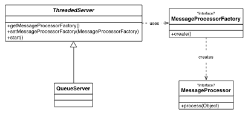

# Server Project
This is a project to create a simple message-oriented threaded server in Java. It is assumed that the server receives messages via some mechanism (e.g., a TCP/IP socket, a queue). The main class is the ``ThreadedServer`` class, which uses the Java [``ExecutorService``](http://docs.oracle.com/javase/6/docs/api/java/util/concurrent/ExecutorService.html) to create a thread pool of worker threads which receive a message and process it using the ``MessageProcessor`` class. Each thread has its own ``MessageProcessor`` in thread-local storage, so the processing code doesn't need to worry about thread safety. The server creates new ``MessageProcessor``s via the ``MessageProcessorFactory``.

## Class Diagram


## Example Code
    ```java
    public class MyServer extends ThreadedServer<String> {

      public static class Processor implements MessageProcessor<String> {
        public void process(String message) {
          System.out.println("Got message: " + message);
        }
      }

      public static class ProcessorFactory implements MessageProcessorFactory<String> {
        public Processor create() {
          return new Processor();
        }
      }

      public String readMessageFromSocket() {
        // Some code here
      }

      @Override
      protected void run() {
        String message = readMessageFromSocket();
        while (message != null) {
          process(message);
        }
      }

      public static void main(String[] args) {
        // Instantiate server
        MyServer server = new MyServer();

        // Give it the message processor factory
		server.setMessageProcessorFactory(new ProcessorFactory());

		// Tell it what type of thread pool to use
		server.setPool(Executors.newCachedThreadPool());

		// Start up the server!
		server.start();
	  }
	}
  ```
